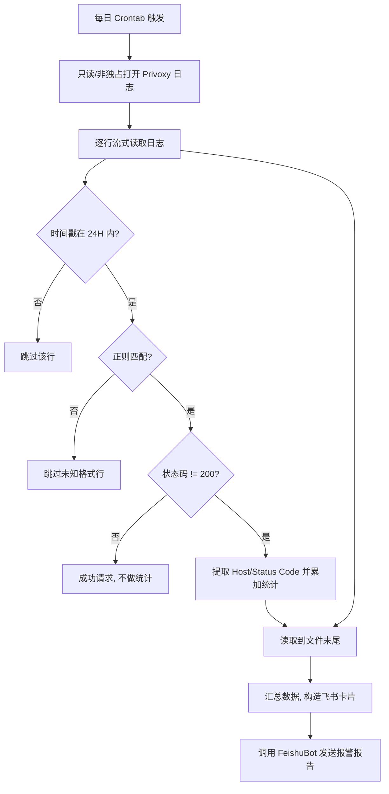

# Privoxy 日志监控任务 (privoxy_monitor) 技术设计文档

该任务每天定时运行一次，用于非阻塞地扫描 Privoxy 代理服务的日志文件，找出过去 24 小时内状态码异常（非 200）的 Host 域名，并统计分析后通过飞书卡片消息推送给用户。

---

## 1. 架构与数据流设计

我们设计了一个轻量级、低侵入性的流式分析管道。整个监控处理流程如下：



---

## 2. 核心技术设计细节

### 2.1 非独占式与低开销日志读取
由于 Privoxy 服务高频、并发地往日志文件追加数据，任何独占性读写锁（如强制锁）都会导致代理写入受阻从而造成请求堆积甚至崩溃。
- **共享非阻塞读取**：在 Linux 系统中，Python 的 `open(log_path, 'r', encoding='utf-8', errors='ignore')` 采用的是协同只读方式，系统不加任何独占锁，保障 Privoxy 可以随时写入。
- **流式迭代（Memory Efficient）**：坚决避免使用 `f.readlines()` 或 `f.read()` 一次性载入内存，以防止大日志文件撑爆内存。通过 `for line in f:` 迭代器流式处理，内存占用固定在 KB 级。

### 2.2 日志正则解析设计
对于目标日志格式：
`192.168.2.135 - - [12/Jun/2026:14:34:18 +0800] "CONNECT bytelink100-ws.amemv.com:443 HTTP/1.1" 200 1115`

我们设计如下高效正则表达式：
```regex
^(\S+)\s+-\s+-\s+\[([^\]]+)\]\s+"(\S+)\s+([^"\s]+)\s+HTTP/[0-9.]+"\s+(\d+)\s+(\S+)
```
**捕获组映射说明**：
- `Group 1`: 客户端源 IP (`192.168.2.135`)
- `Group 2`: 原始时间戳字符串 (`12/Jun/2026:14:34:18 +0800`)
- `Group 3`: 请求方法 (`CONNECT`)
- `Group 4`: 目标主机及端口 (`bytelink100-ws.amemv.com:443`)
- `Group 5`: 状态码 (`200`)
- `Group 6`: 传输大小 (`1115`)

### 2.3 健壮的时间戳解析（解决 Locale 兼容性）
日志时间戳中包含英文月份简写（如 `Jun`）。由于不同 Linux 系统的环境 Locale（语言区域配置）各异，使用 Python 的 `%b` 格式符极易引发解析异常。
为此，我们采用**硬编码月份映射**进行手动解析，确保在任何语言环境的操作系统下都能稳健运行：

```python
MONTH_MAP = {
    'Jan': 1, 'Feb': 2, 'Mar': 3, 'Apr': 4, 'May': 5, 'Jun': 6,
    'Jul': 7, 'Aug': 8, 'Sep': 9, 'Oct': 10, 'Nov': 11, 'Dec': 12
}

def parse_log_time(ts_str):
    # ts_str 格式类似: "12/Jun/2026:14:34:18 +0800"
    try:
        parts = ts_str.split(' ')
        datetime_part = parts[0] # "12/Jun/2026:14:34:18"
        tz_part = parts[1] if len(parts) > 1 else "+0800" # "+0800"
        
        dt_parts = datetime_part.split(':')
        date_part = dt_parts[0] # "12/Jun/2026"
        time_part = ":".join(dt_parts[1:]) # "14:34:18"
        
        day, month_name, year = date_part.split('/')
        month = MONTH_MAP[month_name]
        
        # 转换为 datetime 对象进行 24 小时对比
        dt = datetime(int(year), month, int(day), 
                      *map(int, time_part.split(':')))
        return dt
    except Exception as e:
        return None
```

### 2.4 异常判定规则
- **正常状态**：HTTP 状态码为 `200`（或 `304` 等重定向，依据 Privoxy 特性，我们主要将非 200 认定为错误或需关注的代理异常）。
- **错误状态**：状态码为 `400` ~ `599`。尤其是：
  - `502 Bad Gateway` / `504 Gateway Timeout`：通常意味着代理后端服务或 Host 无法连接。
  - `403 Forbidden` / `404 Not Found`：说明资源受限或 Host 域名失效。

---

## 3. 配置要求

需在项目根目录的 `config.yaml` 中添加以下配置项：

```yaml
privoxy:
  log_path: "/var/log/privoxy/logfile"       # Privoxy 日志的绝对路径
```

> **说明**：脚本直接复用全局默认的飞书通知配置（读取 `feishu.default_receive_id`），无需在 `privoxy` 配置段中独立配置飞书 ID。错误过滤关键字已由脚本内部默认包含。

---

## 4. 飞书报警卡片设计

当检测到异常状态时，发送的红色报警卡片如下：

### 🚨 Privoxy 代理异常监控报告
- **监控周期**：过去 24 小时 (xxxx-xx-xx xx:xx ~ xxxx-xx-xx xx:xx)
- **异常总请求数**：XX 次

#### 📊 故障域名排行 (Top 5 Hosts)
*   **host_name_A**：XX 次 (常见状态码: 502)
*   **host_name_B**：XX 次 (常见状态码: 504)
*   ...

#### 📋 典型异常日志截取
```text
[具体日志行1]
[具体日志行2]
```

---

## 5. 运行与自动调度

### 命令行手动运行
```bash
/media/data/venv/bin/python tasks/privoxy_monitor/main.py
```

### 自动化调度 (Crontab)
建议每天凌晨 0:05 运行一次，分析前一天整天的日志：
```cron
5 0 * * * /media/data/venv/bin/python /media/data/git/feishu_tools/tasks/privoxy_monitor/main.py >> /var/log/privoxy_monitor.log 2>&1
```
